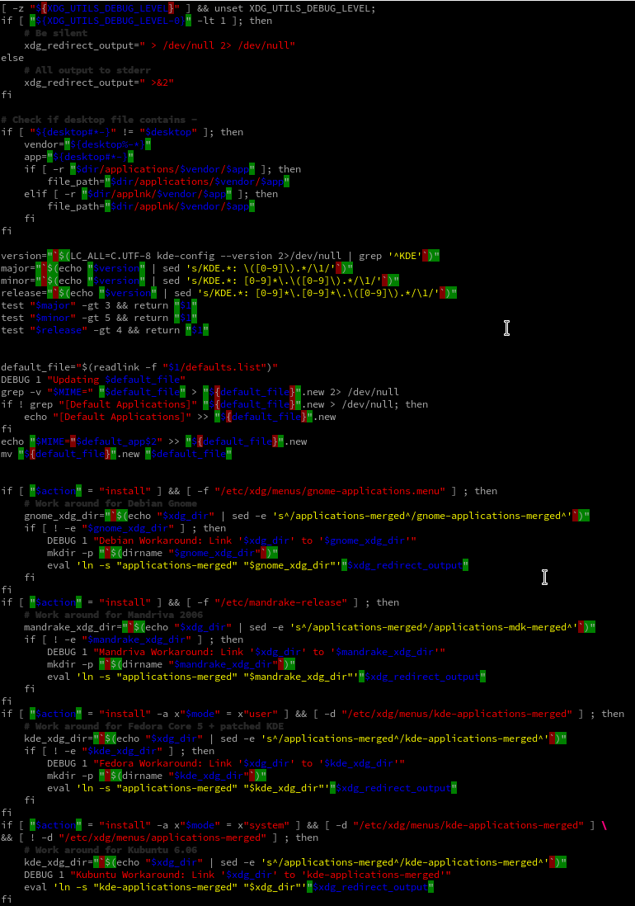
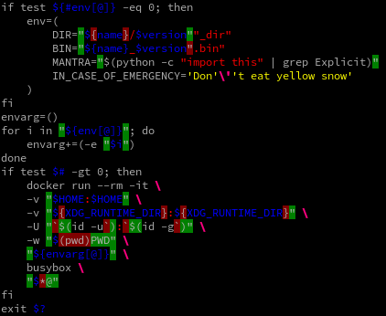

Shellharden
===========

Shellharden is a syntax highlighter and a tool to semi-automate the rewriting
of scripts to ShellCheck conformance, mainly focused on quoting.

The default mode of operation is like `cat`, but with syntax highlighting in
foreground colors and suggestive changes in background colors:

Above: Selected portions of `xdg-desktop-menu` as highlighted by Shellharden.
The foreground colors are syntax highlighting, whereas the background colors
(green and red) show characters that Shellharden would have added or removed
if let loose with the `--transform` option.
Below: An artificial example that shows more tricky cases and special features.

Why
---

A variable in bash is like a hand grenade – take off its quotes, and it starts ticking. Hence, rule zero of [bash pitfalls][1]: Always use quotes.

Name
----

Shellharden can do what Shellcheck can't: Apply the suggested changes.

In other words, harden brittle shellscripts.
The builtin assumption is that the script does not *depend* on the brittle behavior –
the user is responsible for the code review.

Shellharden was previously known as "Naziquote".
In the right jargon, that was the best name ever,
but oh so misleading and unspeakable to outsiders.

I couldn't call it "bash cleaner" either, as that means "poo smearer" in Norwegian.

Prior art
---------

* [Shellcheck][2] is a wonderful tool to *detect*, and give general advice, about brittle bash code. The only thing missing is something to say yes with, and *apply* those advice (assuming proper review of course).

* I asked [this SO question][3], for a tool that could rewrite bash scripts with proper quoting. One answerer beat me to it. But if it was me, I would do a syntax highlighter in the same tool (as a way to see if the parser gets lost, and make the most out of the parser, because bash is like quantum mechanics – nobody really knows how it works).

Get it
------

Distro packages:

* [Arch](https://www.archlinux.org/packages/community/x86_64/shellharden/)
* [Homebrew](https://formulae.brew.sh/formula/shellharden)

Official [rust package](https://crates.io/crates/shellharden):

    cargo install shellharden

For those allergic to building from source, a few precompiled binaries are also available in the [releases](https://github.com/anordal/shellharden/releases).

Build from source
-----------------

    cargo build --release

### Run tests

    cargo test --release

(requires bash)

### Install

    cp target/release/shellharden /usr/local/bin/

### Fuzz test

    cargo install afl
    cargo afl build --release
    cargo afl fuzz -i moduletests/original -o /tmp/fuzz-shellharden target/release/shellharden '@@'

Usage advice
------------

Don't apply `--transform` blindly; code review is still necessary: A script that *relies* on unquoted behavior (implicit word splitting and glob expansion from variables and command substitutions) to work as intended will do none of that after getting the `--transform` treatment!

In that unlucky case, ask yourself whether the script has any business in doing that. All too often, it's just a product of classical shellscripting, and would be better off rewritten, such as by using arrays. Even in the opposite case, say the business logic involves word splitting; that can still be done without invoking globbing. In short: There is always a better way than the forbidden syntax (if not more explicit), but some times, a human must step in to rewrite. See how, in the accompanying [how to do things safely in bash](how_to_do_things_safely_in_bash.md).

[1]: http://mywiki.wooledge.org/BashPitfalls
[2]: https://www.shellcheck.net/
[3]: http://stackoverflow.com/questions/41104131/tool-to-automatically-rewrite-a-bash-script-with-proper-quoting
